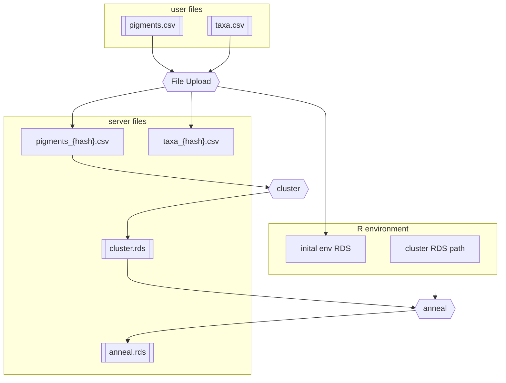

# chemtax-shiny-gui
GUI built using R.shiny for CHEMTAX

# TODO:
* focus on taxa upload/selection

# ===

```R
if (!require('shiny')) install.packages("shiny")
shiny::runApp("app")
```


global.R: data prep and library loading
ui.R: user interface
server.R: server functions



