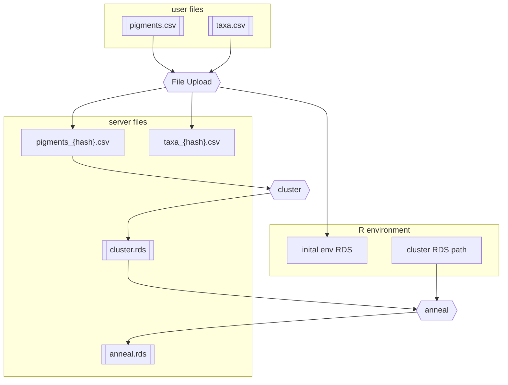
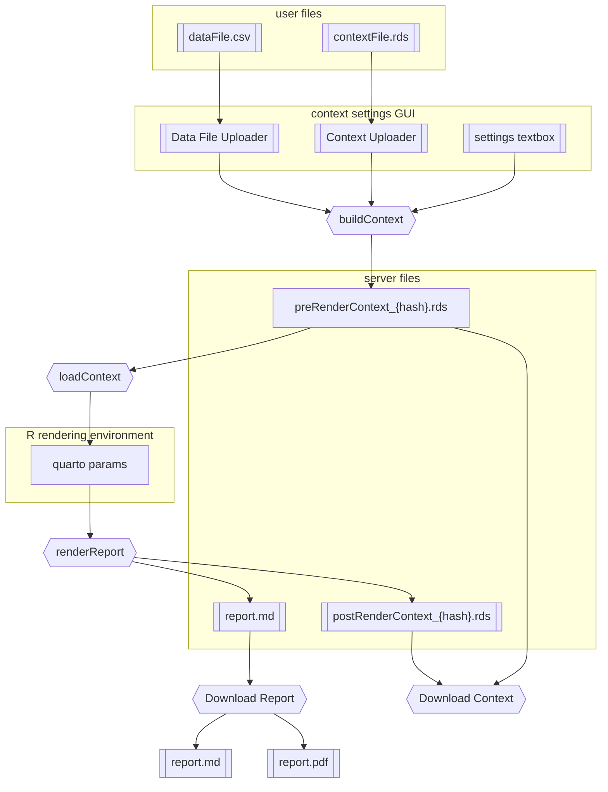

# phytoclass-shiny-gui
GUI built using R.shiny for CHEMTAX and phytoclass users.

TODO:
* add options to clustering
  * distanceType (manhattan etc)

# Setup
## ubuntu
```bash
sudo apt install libfribidi-dev libfontconfig1-dev libfontconfig1-dev
```

## all
```R
if (!require('devtools')) install.packages("devtools")
devtools::install_local()
```


* global.R: data prep and library loading
* ui.R: user interface
* server.R: server functions


# quartoReport module 
The quartoReport module provides a shiny setup for rendering quarto documents within a shiny server using configurable inputs and downloadable outputs.



## .qmd reports
`.qmd` reports used are stored in `./app/www/`. 

## functional overview
1. define input
  * upload .rds
  * (NYI) html to set up the input
  * (NYI)R code to set up variables
2. generate the report with given input
3. download
  * (NYI) .rds of the final environment
  * (NYI) .qmd of the report (including variable setup at beggining)
  * (NYI) .pdf of the report

## reports info flow
Generalized info flow for quartoReport module:


